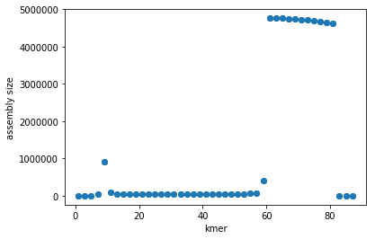
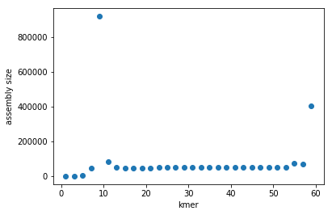
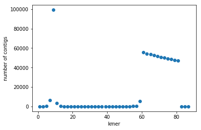
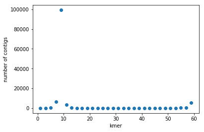
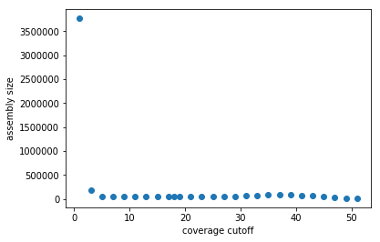
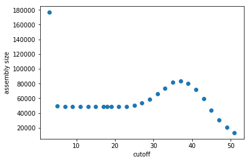
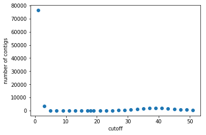
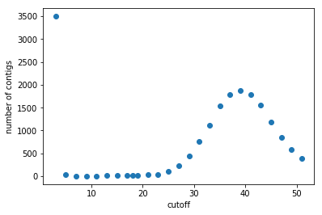

```python
#!/usr/bin/env python3
#Title: Kmer vs assembly size (sum of lens of all the contigs) with cutoff = 6
import matplotlib.pyplot as plt

file = open('./reports/report_lambda/kmer_assembly_final.txt', 'r')

x_axis = []
y_axis = []
for line in file:
    line = line.rstrip()
    line = line.split('\t')
    x_axis.append(int(line[0]))
    y_axis.append(int(line[1]))

print(x_axis,y_axis)
plt.xlabel('kmer length')
plt.ylabel('assembly size')
plt.scatter(x_axis, y_axis)
plt.show()


```

    [1, 11, 13, 15, 17, 19, 21, 23, 25, 27, 29, 3, 31, 33, 35, 37, 39, 41, 43, 45, 47, 49, 5, 51, 53, 55, 57, 59, 61, 63, 65, 67, 69, 7, 71, 73, 75, 77, 79, 81, 83, 85, 87, 9, 1, 11, 13, 15, 17, 19, 21, 23, 25, 27, 29, 3, 31, 33, 35, 37, 39, 41, 43, 45, 47, 49, 5, 51, 53, 55, 57, 59, 61, 63, 65, 67, 69, 7, 71, 73, 75, 77, 79, 81, 83, 85, 87, 9] [1, 83064, 51673, 48350, 48170, 48242, 48345, 48510, 48516, 48516, 48656, 77, 48573, 48580, 48790, 48824, 48759, 48791, 48912, 48909, 48910, 49148, 2116, 49105, 50386, 75502, 71525, 404387, 4763004, 4758540, 4762197, 4751477, 4743677, 47618, 4727161, 4712813, 4689531, 4669063, 4649468, 4624796, 257, 93, 182, 919277, 1, 83064, 51673, 48350, 48170, 48242, 48345, 48510, 48516, 48516, 48656, 77, 48573, 48580, 48790, 48824, 48759, 48791, 48912, 48909, 48910, 49148, 2116, 49105, 50386, 75502, 71525, 404387, 4763004, 4758540, 4762197, 4751477, 4743677, 47618, 4727161, 4712813, 4689531, 4669063, 4649468, 4624796, 257, 93, 182, 919277]





```python
#!/usr/bin/env python3
#Title: Kmer vs assembly size (sum of lens of all the contigs) with cutoff = 6
import matplotlib.pyplot as plt

file = open('./reports/report_lambda/kmer_assembly_final_below60.txt', 'r')

x_axis = []
y_axis = []
for line in file:
    line = line.rstrip()
    line = line.split('\t')
    x_axis.append(int(line[0]))
    y_axis.append(int(line[1]))

print(x_axis,y_axis)
plt.xlabel('kmer length')
plt.ylabel('assembly size')
plt.scatter(x_axis, y_axis)
plt.show()
```

    [1, 11, 13, 15, 17, 19, 21, 23, 25, 27, 29, 3, 31, 33, 35, 37, 39, 41, 43, 45, 47, 49, 5, 51, 53, 55, 57, 59, 7, 9] [1, 83064, 51673, 48350, 48170, 48242, 48345, 48510, 48516, 48516, 48656, 77, 48573, 48580, 48790, 48824, 48759, 48791, 48912, 48909, 48910, 49148, 2116, 49105, 50386, 75502, 71525, 404387, 47618, 919277]





```python
#!/usr/bin/env python3
#Title: kmer size vs number of contigs with cutoff = 6
import matplotlib.pyplot as plt

file = open('./reports/report_lambda/kmer_contig_final.txt', 'r')

x_axis = []
y_axis = []
for line in file:
    line = line.rstrip()
    line = line.split('\t')
    x_axis.append(int(line[0]))
    y_axis.append(int(line[1]))

print(x_axis,y_axis)
plt.xlabel('kmer length')
plt.ylabel('number of contigs')
plt.scatter(x_axis, y_axis)
plt.show()


```

    [1, 11, 13, 15, 17, 19, 21, 23, 25, 27, 29, 3, 31, 33, 35, 37, 39, 41, 43, 45, 47, 49, 5, 51, 53, 55, 57, 59, 61, 63, 65, 67, 69, 7, 71, 73, 75, 77, 79, 81, 83, 85, 87, 9] [1, 3583, 320, 33, 16, 17, 18, 23, 20, 17, 20, 23, 15, 13, 17, 17, 13, 13, 15, 14, 13, 17, 401, 15, 36, 447, 370, 5328, 55621, 54450, 53539, 52518, 51648, 6571, 50748, 49970, 49151, 48448, 47826, 47204, 3, 1, 2, 99288]





```python
#!/usr/bin/env python3
#Title: kmer size vs number of contigs with cutoff = 6
import matplotlib.pyplot as plt

file = open('./reports/report_lambda/kmer_contig_final_below60.txt', 'r')

x_axis = []
y_axis = []
for line in file:
    line = line.rstrip()
    line = line.split('\t')
    x_axis.append(int(line[0]))
    y_axis.append(int(line[1]))

print(x_axis,y_axis)
plt.xlabel('kmer length')
plt.ylabel('number of contigs')
plt.scatter(x_axis, y_axis)
plt.show()


```

    [1, 11, 13, 15, 17, 19, 21, 23, 25, 27, 29, 3, 31, 33, 35, 37, 39, 41, 43, 45, 47, 49, 5, 51, 53, 55, 57, 59, 7, 9] [1, 3583, 320, 33, 16, 17, 18, 23, 20, 17, 20, 23, 15, 13, 17, 17, 13, 13, 15, 14, 13, 17, 401, 15, 36, 447, 370, 5328, 6571, 99288]





```python
#!/usr/bin/env python3
#Title cutoff vs assembly size for kmer = 31
import matplotlib.pyplot as plt

file = open('./reports/report_lambda/cutoff_assembly_final.txt', 'r')

x_axis = []
y_axis = []
for line in file:
    line = line.rstrip()
    line = line.split('\t')
    x_axis.append(int(line[0]))
    y_axis.append(int(line[1]))

print(x_axis,y_axis)
plt.xlabel('coverage cutoff')
plt.ylabel('assembly size')
plt.scatter(x_axis, y_axis)
plt.show()
```

    [18, 1, 11, 13, 15, 17, 19, 21, 23, 25, 27, 29, 3, 31, 33, 35, 37, 39, 41, 43, 45, 47, 49, 5, 51, 7, 9] [48573, 3764625, 48624, 48867, 48769, 48652, 48718, 48992, 48888, 50583, 54006, 59044, 176696, 66485, 73835, 81704, 83324, 80360, 71910, 59545, 44041, 30878, 20797, 49371, 13314, 48471, 48464]





```python
#!/usr/bin/env python3
#Title cutoff vs assembly without cutoff = 1 for kmer = 31
import matplotlib.pyplot as plt

file = open('./reports/report_lambda/cutoff_assembly_final_no1.txt', 'r')

x_axis = []
y_axis = []
for line in file:
    line = line.rstrip()
    line = line.split('\t')
    x_axis.append(int(line[0]))
    y_axis.append(int(line[1]))

print(x_axis,y_axis)
plt.xlabel('coverage cutoff')
plt.ylabel('assembly size')
plt.scatter(x_axis, y_axis)
plt.show()
```

    [18, 11, 13, 15, 17, 19, 21, 23, 25, 27, 29, 3, 31, 33, 35, 37, 39, 41, 43, 45, 47, 49, 5, 51, 7, 9] [48573, 48624, 48867, 48769, 48652, 48718, 48992, 48888, 50583, 54006, 59044, 176696, 66485, 73835, 81704, 83324, 80360, 71910, 59545, 44041, 30878, 20797, 49371, 13314, 48471, 48464]





```python
#Title: cutoff vs number of contigs with kmer = 31
#!/usr/bin/env python3
import matplotlib.pyplot as plt

file = open('./reports/report_lambda/cutoff_no_contig.txt', 'r')

x_axis = []
y_axis = []
for line in file:
    line = line.rstrip()
    line = line.split('\t')
    x_axis.append(int(line[0]))
    y_axis.append(int(line[1]))

print(x_axis,y_axis)
plt.xlabel('coverage cutoff')
plt.ylabel('number of contigs')
plt.scatter(x_axis, y_axis)
plt.show()
```

    [18, 1, 11, 13, 15, 17, 19, 21, 23, 25, 27, 29, 3, 31, 33, 35, 37, 39, 41, 43, 45, 47, 49, 5, 51, 7, 9] [15, 76394, 7, 17, 17, 16, 21, 34, 36, 100, 236, 445, 3498, 766, 1122, 1532, 1778, 1873, 1787, 1553, 1182, 845, 583, 28, 381, 1, 1]





```python
#Title: cutoff vs number of contigs without cutoff = 1 for kmer = 31
#!/usr/bin/env python3
import matplotlib.pyplot as plt
file = open('./reports/report_lambda/cutoff_no_contig_no1.txt', 'r')

x_axis = []
y_axis = []
for line in file:
    line = line.rstrip()
    line = line.split('\t')
    x_axis.append(int(line[0]))
    y_axis.append(int(line[1]))

print(x_axis,y_axis)
plt.xlabel('coverage cutoff')
plt.ylabel('number of contigs')
plt.scatter(x_axis, y_axis)
plt.show()
```

    [18, 11, 13, 15, 17, 19, 21, 23, 25, 27, 29, 3, 31, 33, 35, 37, 39, 41, 43, 45, 47, 49, 5, 51, 7, 9] [15, 7, 17, 17, 16, 21, 34, 36, 100, 236, 445, 3498, 766, 1122, 1532, 1778, 1873, 1787, 1553, 1182, 845, 583, 28, 381, 1, 1]





```python
def rev_comp(x):
  output =  x.lower().replace('a', 'T').replace('t', 'A').replace('g','C').replace('c','G')[::-1]
  return output

def kmer_count(filename, kmer_length):
   FILE = open(filename, 'r')
   kmers = {}
   for line in FILE:
    header = line
    seq = ''
    for line in FILE:
        seq += line.rstrip()
    #sliding window
    for i in range(0, len(seq) - kmer_length + 1):
       kmer = seq[i:i + kmer_length]
       if kmer in kmers:  
          kmers[kmer] += 1
          kmers[rev_comp(kmer)] += 1
          
       else: 
          kmers[kmer] = 1
          kmers[rev_comp(kmer)] = 1
   return len(kmers)

kmers_length = []
list_count = []


for i in range(1, 99, 2):
   kmers_length.append(i)
   list_count.append(kmer_count('./data/lambda.fasta', i))

print(kmers_length, list_count)
plt.xlabel('kmer length')
plt.ylabel('number of kmer in dictionary')
plt.scatter(kmers_length, list_count)
plt.show()
```

    [1, 3, 5, 7, 9, 11, 13, 15, 17, 19, 21, 23, 25, 27, 29, 31, 33, 35, 37, 39, 41, 43, 45, 47, 49, 51, 53, 55, 57, 59, 61, 63, 65, 67, 69, 71, 73, 75, 77, 79, 81, 83, 85, 87, 89, 91, 93, 95, 97] [4, 64, 1024, 15566, 74216, 94758, 96840, 96964, 96972, 96968, 96964, 96960, 96956, 96952, 96948, 96944, 96940, 96936, 96932, 96928, 96924, 96920, 96916, 96912, 96908, 96904, 96900, 96896, 96892, 96888, 96884, 96880, 96876, 96872, 96868, 96864, 96860, 96856, 96852, 96848, 96844, 96840, 96836, 96832, 96828, 96824, 96820, 96816, 96812]


```python

```


```python

```
