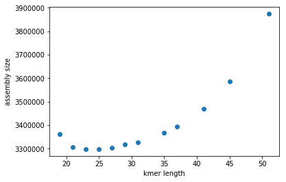
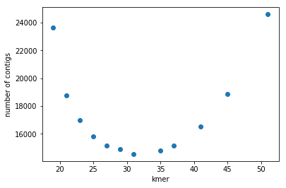
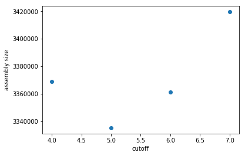
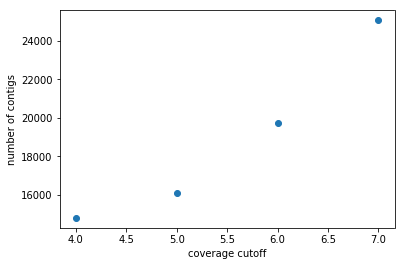

```python
#!/usr/bin/env python3
#Title: Kmer vs assembly size (sum of lens of all the contigs) with cutoff = 4
import matplotlib.pyplot as plt

file = open('./report_final_assembly/kmer_assembly_final.txt', 'r')

x_axis = []
y_axis = []
for line in file:
    line = line.rstrip()
    line = line.split('\t')
    x_axis.append(int(line[0]))
    y_axis.append(int(line[1]))

print(x_axis,y_axis)
plt.xlabel('kmer length')
plt.ylabel('assembly size')
plt.scatter(x_axis, y_axis)
plt.show()


```

    [19, 21, 23, 25, 27, 29, 31, 35, 37, 41, 45, 51] [3361568, 3305926, 3298577, 3298199, 3305102, 3318221, 3327892, 3368670, 3394733, 3469786, 3585768, 3873682]





```python
#!/usr/bin/env python3
#Title: kmer size vs number of contigs with cutoff = 4
import matplotlib.pyplot as plt

file = open('./report_final_assembly/kmer_contigs_final.txt', 'r')

x_axis = []
y_axis = []
for line in file:
    line = line.rstrip()
    line = line.split('\t')
    x_axis.append(int(line[0]))
    y_axis.append(int(line[1]))

print(x_axis,y_axis)
plt.xlabel('kmer length')
plt.ylabel('number of contigs')
plt.scatter(x_axis, y_axis)
plt.show()


```

    [19, 21, 23, 25, 27, 29, 31, 35, 37, 41, 45, 51] [23649, 18770, 16994, 15832, 15167, 14870, 14541, 14797, 15149, 16509, 18842, 24589]





```python
#!/usr/bin/env python3
#Title cutoff vs assembly size for kmer = 35
import matplotlib.pyplot as plt

file = open('./report_final_assembly/cutoff_assembly_final.txt', 'r')

x_axis = []
y_axis = []
for line in file:
    line = line.rstrip()
    line = line.split('\t')
    x_axis.append(int(line[0]))
    y_axis.append(int(line[1]))

print(x_axis,y_axis)
plt.xlabel('coverage cutoff')
plt.ylabel('assembly size')
plt.scatter(x_axis, y_axis)
plt.show()
```

    [4, 5, 6, 7] [3368670, 3335141, 3361332, 3419595]





```python
#Title: cutoff vs number of contigs with kmer = 35
#!/usr/bin/env python3
import matplotlib.pyplot as plt

file = open('./report_final_assembly/cutoff_contig_final.txt', 'r')

x_axis = []
y_axis = []
for line in file:
    line = line.rstrip()
    line = line.split('\t')
    x_axis.append(int(line[0]))
    y_axis.append(int(line[1]))

print(x_axis,y_axis)
plt.xlabel('coverage cutoff')
plt.ylabel('number of contigs')
plt.scatter(x_axis, y_axis)
plt.show()
```

    [4, 5, 6, 7] [14797, 16113, 19734, 25069]





### Dot plot of the alignment of the assembly (kmer = 35, coverage cutoff = 4) to the reference sequence


nucmer refrence assembly

mummerplot --layout --fat -t png output

N50:	1201

L50:	763


```python

```
